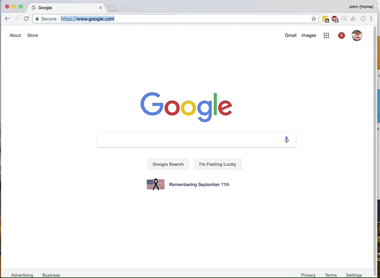

# Zoom Tab Destroyer
---

This simple extension does one thing, and (hopefully) does it well. When you open a "Zoom.us" meeting link in your browser, it waits until the Zoom desktop app has joined the meeting and then destroys the tab automatically. Yeah, we know that it's not much but we're ok with that. 

